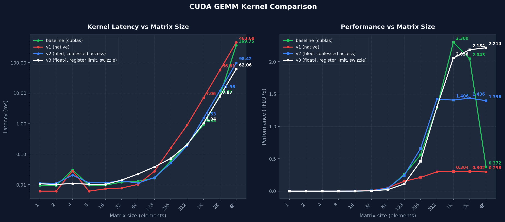

### 介绍
一个CUDA GEMM算子，有fp32的cuda版本和fp16混合精度的tensor core版本

### 技术特性
分块优化：结合Shared Memory与Register Blocking分块，减少Global Memory访存，提升FFMA计算密度。  
地址对齐：使用alignas(128)确保首地址对齐缓存行，支持向量化指令提高访存效率。  
合并访存：通过调整访问模式合并访存，有效利用带宽。  
向量化访存：用float4向量化访存减少mio指令数量和地址计算开销。  
分支避免：用乘法运算代替分支，对编译器指令重排更友好。  
数据重排：通过重排数据存储位置，精确控制warp内bank分配，消除bank conflict。  
硬件资源约束：使用launch_bounds控制寄存器用量，确保维持活跃Warp数。  
双缓冲：多处使用双缓冲思想，使用cp.async加载和寄存器预取。  
tensor core：使用ldmatric和mma加载和计算fp16。  
swizzle：使用block swizzling优化缓存命中率。  
编译期计算：通过编译期计算分支条件减少运行时分支。  

### 构建和运行
#### 1. fp32 cuda kernel  
运行环境 windows msvc  
构建依赖`CMake`、`nvcc`、`MSVC`和`Ninja`  
请自行更改或在命令行指定`CMakeLists`中的`CMAKE_CUDA_ARCHITECTURES` `CMAKE_CUDA_HOST_COMPILER`和`CMAKE_CXX_COMPILER`  
在`x64 Native Tools Command Prompt for VS 2022`中在项目目录运行  
```
cmake -G "Ninja Multi-Config" -S ./ -B build
cmake --build ./build --config RelWithDebInfo
.\build\RelWithDebInfo\proj.exe
```

#### 2. fp32 benchmark  
运行环境 windows msvc  
构建依赖`CMake`、`nvcc`、`MSVC`和`Ninja`  
请自行更改`./benchmark/run_benchmark.py` `compile_kernel`中的`cl.exe`位置和`arch`版本号  
在项目目录运行  
```
cd ./benchmark
python run_benchmark.py
```
测试结果输出到图片`benchmark_results.png`

#### 3. fp16 benchmark  
运行环境 linux + 4090  
如果要在A800测试请用 `custom_gemm(A800).cu` 的文件内容替换 `custom_gemm.cu` 并自行更改`./benchmark_linux/run_benchmark.py` `compile_kernel`中的`arch`版本号  
在项目目录运行  
```
cd ./benchmark_linux
python run_benchmark.py
```
测试结果输出到图片`benchmark_results.png`

### 性能测试

#### 1. RTX4090测试
| 指标 | 参数 |
| :--- | :--- |
| **GPU** | NVIDIA GeForce RTX4090 |
| **Compute Capability** | 8.9 (Ampere) |
| **SM 数量** | 128 |
| **显存带宽** | 1 TB/s |
| **理论算力** | 330 TFLOPS |

测试对象是fp16混合精度的gemm kernel，baseline比较对象也是cublasGemmEx CUBLAS_COMPUTE_32F的混合精度计算。  
下图是python下ctypes调用dll测试benchmark的结果，用`-O3`编译  
1024到8192的范围性能基本与cublas持平，多次测试有波动，基本8192稳定在155 tflops左右，在cublas`95%`以上

.png)

因为在云端环境没有权限使用ncu分析

#### 2. A800测试
| 指标 | 参数 |
| :--- | :--- |
| **GPU** | NVIDIA A800 (80GB) |
| **Compute Capability** | 8.0 (Ampere) |
| **SM 数量** | 108 |
| **显存带宽** | 2 TB/s |
| **理论算力** | 312 TFLOPS |

测试对象是fp16混合精度的gemm kernel，baseline比较对象也是cublasGemmEx CUBLAS_COMPUTE_32F的混合精度计算。  
下图是python下ctypes调用dll测试benchmark的结果，用`-O3`编译  
多次测试8192稳定在205 tflops左右，在cublas`75%`以上

.png)

因为在云端环境没有权限使用ncu分析

#### 3. MX450测试

| 指标 | 参数 |
| :--- | :--- |
| **GPU** | NVIDIA GeForce MX450 |
| **Compute Capability** | 7.5 (Turing) |
| **SM 数量** | 14 |
| **显存带宽** | 80 GB/s |
| **理论算力** | 2.5 TFLOPS |

在`mx450`上测试$2048^3$的GEMM计算性能达到`cublasSgemm`的约`95%`，用`RelWithDebInfo`编译

```
kernel time : 8.43162ms, total time: 20.8321ms, tflops: 2.03755
cublas kernel time: 8.16333ms, rate: 0.968181
```

下图是python下ctypes调用dll测试benchmark的结果，用`-O3`和`/O2`编译，显示8192大小下达到2.2tflops，为硬件上限的88%。



下面是nsight的测试结果


位于Roofline模型右侧处于计算瓶颈，达到85.54%的Compute Throughput


__launch_bounds__限制后，寄存器和共享内存共同限制了Occupancy，active warp数量达到理论值的97%，有效掩盖访存延迟


Math Pipe Throttle达到33.76%，证明运算单元处于满载排队状态
